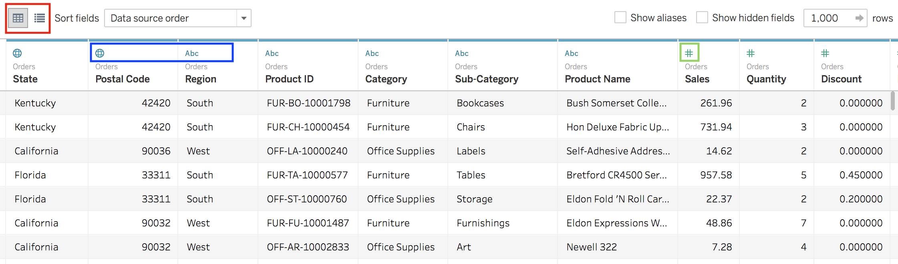

# Tableau Public: Making quick data visualizations

## What is Tableau?
Tableau is a tool meant for turning cleaned data quickly into interactive visualizations

Tableau Public is free, but data is openly saved on the web. Free academic licenses are granted for Tableau Desktop which allows saving workbooks locally, but the free license is only for teaching, not research. Tableau Prep is another pay-for software that is aptly named - it's for prepping data for analysis in Tableau Desktop.

## This introductory exercise will address:

- Tableau's automatic data classifications
- Working with spreadsheet data (Excel)
- Working with geospatial data and background maps
- Investigating other data source files

## Set up

**Downloading**

* [Tableau Public download](https://public.tableau.com/en-us/)

Enter your email address you want associated with Tableau and click "Download the App." The version for 32-bit Windows will automatically start downloading. Cancel and pick a different file if you want 64-bit or the Mac version.

**Getting Started**

* [Tableau Help](https://onlinehelp.tableau.com/current/pro/desktop/en-us/default.htm) - There is a lot of online support for this software.

*Three steps to Data Visualization Fun:*
* Data verification (format/cleaning/understanding)
* Connect to your data
* Visualize and Explore

**Connecting**

*Data formats that play nicely*
* Excel
* Text files
* .JSON
* Spatial files
* Statistical files
* PDFs

We'll pick a provided example excel file from Tableau: Data_Viz_Tableau_Public_Superstore_Data

Drag the "Orders" sheet to the space where it says to and we'll be off and running!

**Measures & Dimensions and all sorts of things**

Examples and discussion...
