# Blender: Making topographic relief beautiful

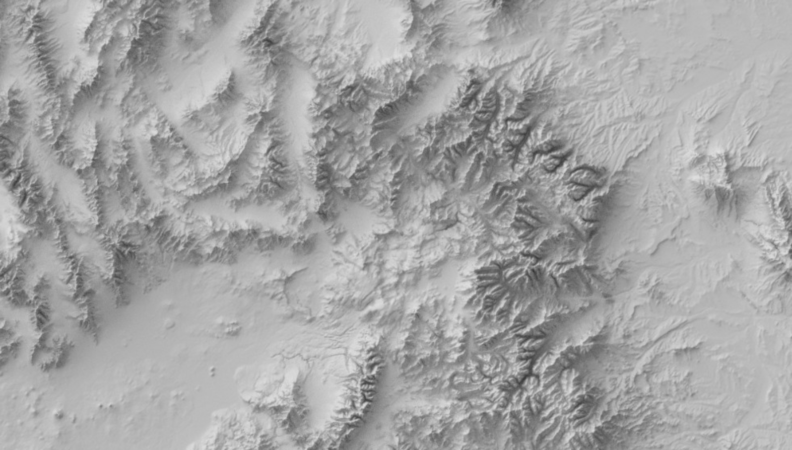

## Tutorial Overview
Blender is a complex, opensource 3D animation software that we can use for rendering digital elevation models for beautiful relief cartography and scene building. The advantage of Blender is it’s built for flexible light simulation so we can create more realistic visuals on our landscape within this software relative to GIS platforms.

The GUI for Blender is overwhelming (SO MANY THINGS!), but this tutorial is meant to direct you to the bits you need for topographic rendering.

This exercise follows an excellent and more detailed tutorial by Daniel Huffman, but I've pulled out the skeleton of his workflow and updated the visuals with the 2.8 release UI and nuances. For more in-depth discussion of what we're doing, please see his tutorial for 2.79 (He'll be updating for 2.8 soon!). It's excellent: [Huffman Tutorial](https://somethingaboutmaps.wordpress.com/2017/11/16/creating-shaded-relief-in-blender/)

**What we'll do:**

- Touch on prepping digital elevation data
- Get oriented to Blender’s GUI
- Build a "mesh" that we mold with our elevation data
- Set up our “photography studio” to highlight our topography with our desired perspective
- Final product: a Blender file that will let us easily create a hillshade for any DEM we want!

## Needed Things

**Blender Software & Height Map**

You can download Blender software here: [Blender download](https://www.blender.org/)

Get 2.8! This new, and very different version has a much slicker interface and many of the odd hangups from previous releases have been happily tweakee, so we don't have to do all the steps that 2.79 required. However, if you're following instructions made before this release for whatever you're investigating, you can still get older versions.

In the next section, we'll briefly discuss how to prep a height map to use in Blender, but there are two provided for you in this tutorial to get you started in the *DEMs* folder one step back in this repo (Blender2019):

AOI_SouthArapahoePeak	(1001 x 1325 pixels) 	An example of a close crop of some 10m x 10m elevation data

HuffmanDEM.tif		(2000 x 2800 pixels)	Perfect file from Daniel Huffman's original tutorial

To download a file, click on the filename name and you'll see a Download option on the individual page for that file.

*Remember the pixel dimensions of your file. You'll need them!*

## Make a Height Map

**Building a file Blender can understand from digital elevation data (DEM)**

Here are the brief steps that you need to follow to create your own DEM file

- Get data – think about your needed resolution!

- Mosaic/merge elevation rasters if needed (you need this if your data is coming in more than one file)

- Reproject your raster to your desired CRS before you put it in Blender!

  - Blender isn't meant for working with spatially located or scaled data, so make sure you convert everything you want to work with to the same projection before you stuff it in. Blender is dimension naive and doesn't have the capability of doing conversions in real space. It operates on "blender units" and has its own relative scale system.

- Clip to your AOI

  - If your pixels/data don't go all the way to the edge of your file, Blender will try to render those boundaries and you'll get weird walls or other artifacts.

- Resample DEM if you want to lower its resolution

- Rescale – Blender *needs* to read integer values

  - Blender will round data to integers,thus losing a lot of information in the elevation data if we don’t rescale.

  - Say your original data runs from 40.7m – 120.4m… blah blah blah. Also, if you’re working in Death Valley or wanting to use bathemytry, we need to get rid of negative values because Blender won’t understand them. Our final output target is going to be a 16-bit unsigned integer TIFF. This means that each pixel can hold a number between 0 and 65,535.
	
  - This equation is your friend: (PixelValue – LowElev) ÷ (HighElev – LowElev) * 65,535
 
 
 
## Blender Orientation

**What are ALL THESE THINGS?**

Okay, I'm not answering that because the GUI is overwhelming, but here's how to start...

When you first open Blender 2.8, you'll see something like this:

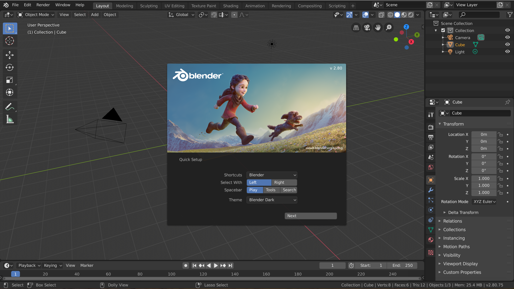

Click anywhere to make the cute characters go away and you'll be asked to set a default for your spacebar. Because we're not focused on animations, I recommend switching away from *Play* to *Tools*:

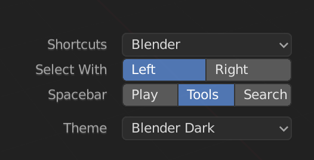

After all the startup windows disappear, you'll see a workspace where we have a studio for viewing and illuminating a landscape we build based off of our height map. You'll see three objects surrounded by a bunch of buttons. It looks like this:

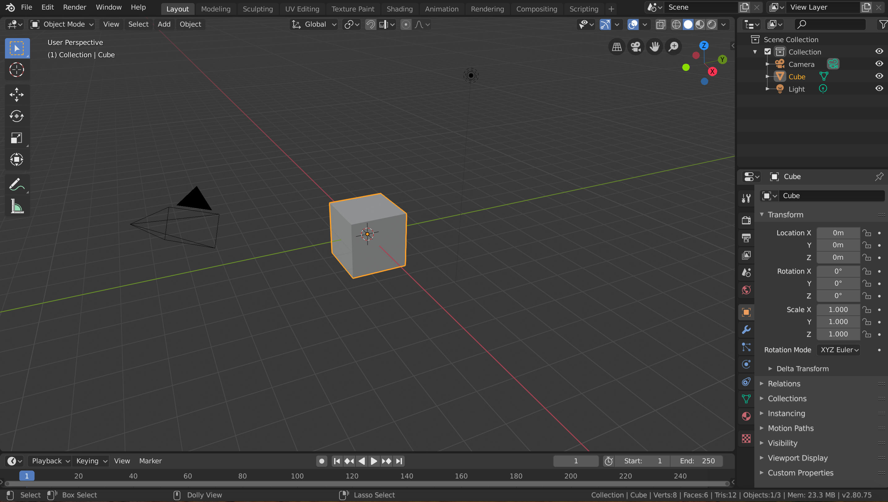

The cube in the middle is the default object Blender loads to work with. The cube is one kind of base mesh for constructing shapes. We're going to use a different mesh for our landscape, but we'll play with this one for starters.

The weird, floating, see-through pyramid with a triangle on it is our camera. When Blender renders a scene, it is the perspective of this camera that forms the view.

The third thing, the dot with dashed haloes, is the light source for our studio.

**Navigating**

Moving around in this interface is not intuitive. And it's really hard without a 3-button mouse unless we *tell* Blender we're lowly geospatial folk that aren't equipped with gamer hardware

So, **IMPORTANT**: Set user preferences by going up to the menus at the top and follow *Edit > Preferences > Input* and toggle on the option for "Emulate 3-Button Mouse" ... unless you actually have a 3 button mouse. These settings are automatically saved.

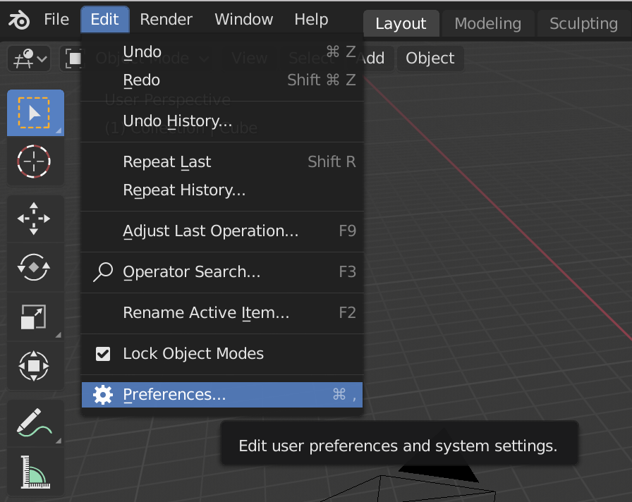

Now we can move around the space with the following commands

Mouse:

- Zoom in and out = Scroll wheel if you have one OR Alt + ctrl + left click/hold and drag 
- Spinning or rotating the view = click/hold middle button (scroll wheel) and drag OR Alt + left click/hold and drag
- Panning = (not sure with a 3-button mouse) OR Shift +Alt + click/hold and drag

Touch pad (mac):

- Zoom in and out = spread/contract two fingers on touch pad
- Spinning or rotating the view = Alt  + click/hold and drag
- Panning = Shift + Alt + click/hold and drag

**Menus**

Let's look at the tabs across the top. You'll see we're in "Layout" right now, and we'll pretty much stay there for the whole tutorial. The only other tab we'll use is the "Render" tab. In fact, try it right now. Go to *Render > Render Image* and see what happens!

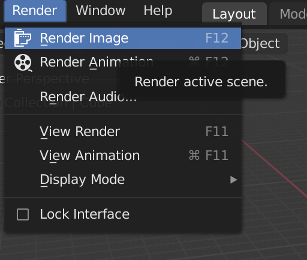

You should see a view of the cube from the camera's perspective. You can hit *Esc* to make this window go away.

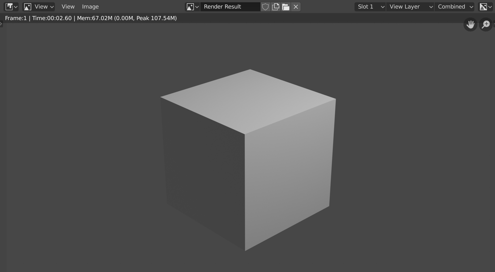

Okay, there is one more tab across the top we need to pay attention to frequently: "File." Because under here we can find our all-important *Save* option. Save your file right now in whichever location you'd like. It will have the suffix *.blend* Feel free to leave it as *untitled* and change the name later.

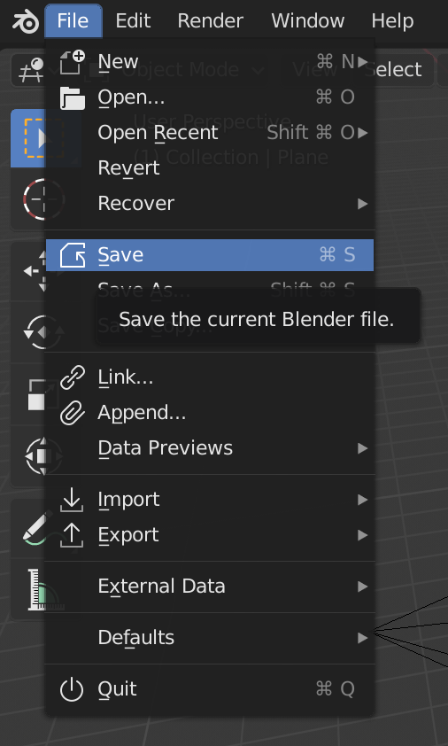

The main menu area we'll be using is the Context Menu on the lower right, also known as the Properties Panel. It defaults to the object context, but you can click on all the colored icons in the vertical column to expose property settings for all sorts of Blender functionalities. Hover over the icons if you'd like to see what they represent.

One of the items in this Context Menu we want to adjust is the kind of renderer we going to use. Look for the little white icon that seems a bit like an SLR camera. The default renderer is Eevee, but we want to switch to the Cycles renderer:

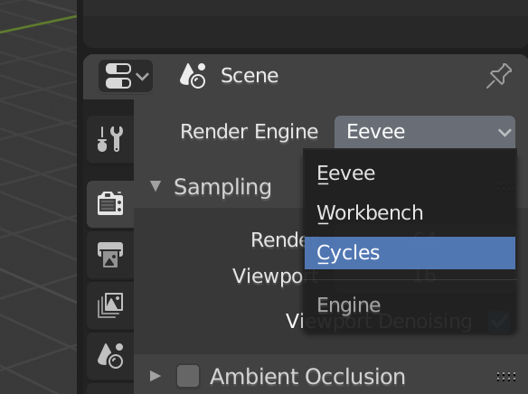

This isn't enough to accomplish what we want. There is an option under Features that says "Supported", but we want to switch this to "Experimental" because there is one option of adding nodes to our mesh that helps optimize their placement when representing landscapes. This option still isn't in the supported models of 2.8, but we love it. Make sure you've switched to "Experimental" and maybe untoggle "Hair" unless you want to add fur to your mountains sometime:

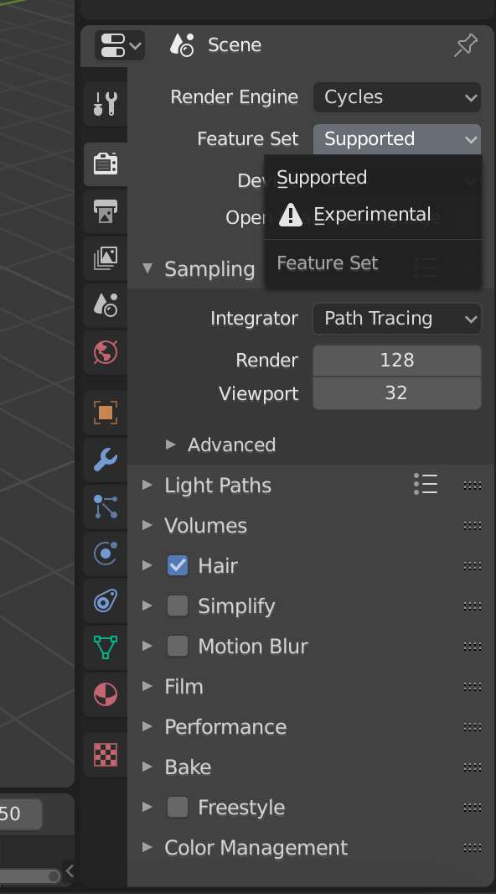

Above the Context Menu, is the Outliner area where the objects in the workspace are listed. You can select the objects by clicking on them in this list, or you can click on them directly in the workspace. They'l turn bright orange when selected.

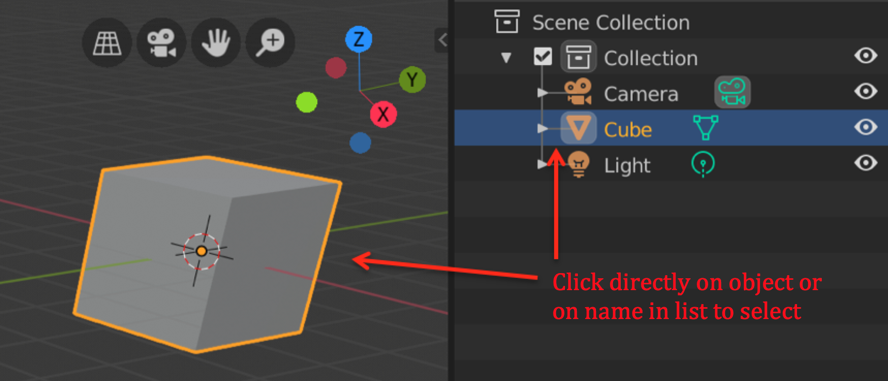

The only other menu options we'll be using are located in the upper left corner under our "Render" tab. You'll see a button that looks like this 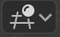. Presently, that means we're in our 3D-View editor. If you click on this button, you'll see a lot of other editor options. We'll use one of these later.

The drop-down under Object mode allows us to swich to Edit mode. You can also flip back and forth between this two modes with the *TAB* key. Our meshes are vector graphics just like we know in spatial data, so we can grab the vertices and drag them around to change the shape of our mesh. Play with your cube a bit if you'd like!

The vertical menu on the upper left side has a few buttons that control our mouse function we'll use just to get familiar with the space. Hover over some of them to see what they are. Right now, our mouse is on the default "Select Box" tool at the top so we can click/drag and select many things at once. The 3rd button down with the arrows is used for dragging around objects in our workspace. You can move meshes, the camera and the light source when they're selected (don't forget the two ways of selecting!).

The red & white circle thing is strange. It's called the 3D cursor and it helps with controlling the location of objects. Pick this tool, then click around on the workspace... the red & white circle moves to where you click.

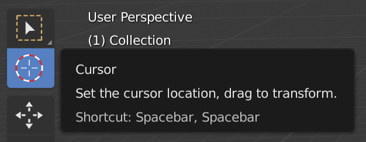

Not terribly exciting. BUT, it becomes more fun once we talk about importing new meshes!

There is another menu to mention here that allows for more controlled movement of this cursor (and other things) in the workspace: the object contect menu. You find it by right clicking in blank space. If you go to "Snap", you'll see ways of snapping the cursor to other objects, etc. Play around.

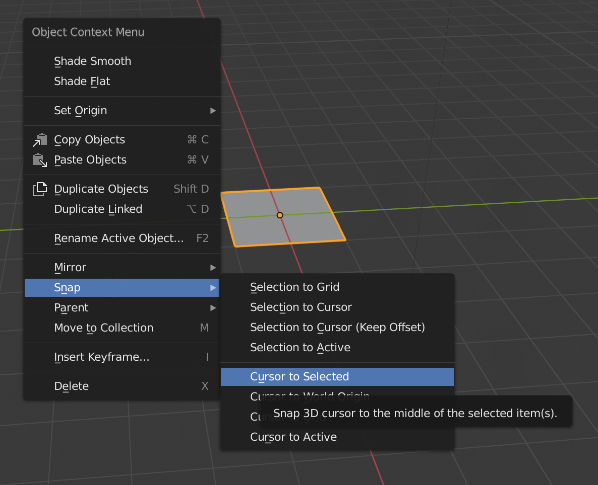

**Meshes**

I mentioned that the cube was one of many basic mesh forms we can add to Blender. Go to the "Add" menu up near the "Object Mode" menu and click on it. (The menu items in this area are fairly easy to understand, happily!) You can also use the shortcut *Shft-A* to pull up this add menu. Pick a mesh and add anything you'd like... and notice where it lands relative to your 3-D cursor.

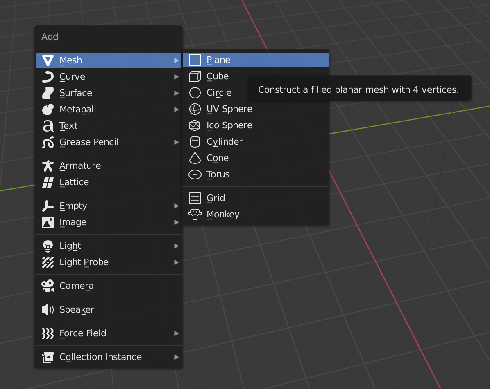

After a lot of messing around, your workspace may look like this:

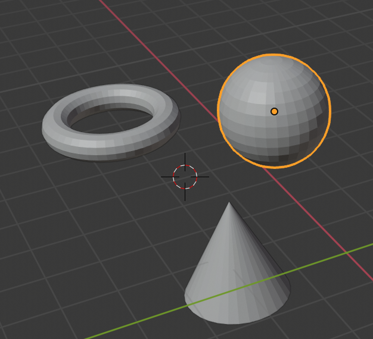

To clean it up, you can delete selected objects with the shortcut key X. Don't worry, Blender will ask you to confirm your deletion before it does it.

So now that we're familiar with the space, let's start with a blank workspace and start on our topographic rendering!

## Creating our Landscape Mesh

**Add a Plane**

After deleting all your other meshes, use *Shft-A* to add a Plane mesh to your work space.

**Adjust location and size**

Don't worry if it didn't land in the middle becaue the 3D-cursor was off in a weird place becaue you can adjust the mesh location manually. Make sure your plane is selected and go to the Context Menu and click on the orange box (the object context) if it isn't picked already. You can then type in the XYZ coordinates of your plane manually. Set them all to 0:

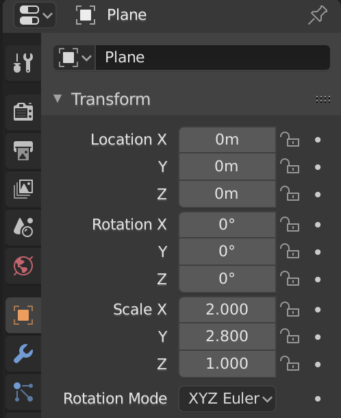

Also, this is where the size of our file comes into play. Notice the *Scale* for X is set to 2.0 and Y is 2.8. These numbers correspond to the 2000 x 2800 size of the HuffmanDEM.tif.	

**Assigning a Material**

Now we want to tell Blender what our plane is made of so it knows how to bounce light off of it. There are LOTS of variables you can change here like color, etc., but we're just going to assign a basic material and adjust what light scattering method we want Blender to use.

Select the material icon from in the Context Menu:

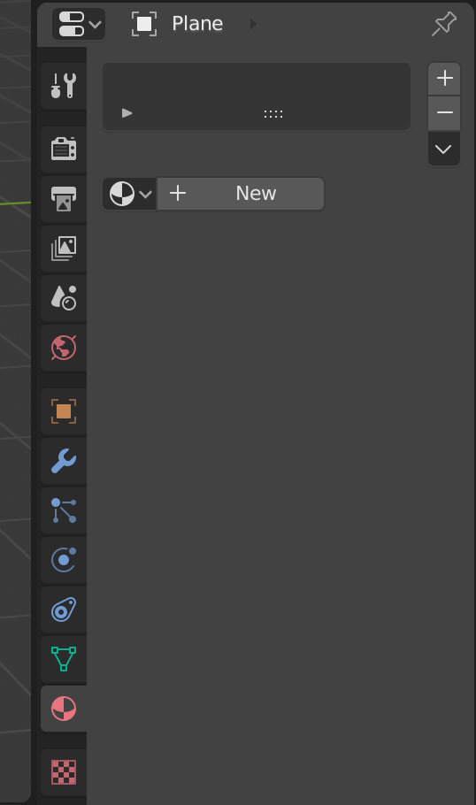

Click on "New" to add a material to our plane. The only thing we need to change in the following menu is the Surface setting, but feel free to play around with these options at a later time. I, personally, want to make a metallic landscape one day.

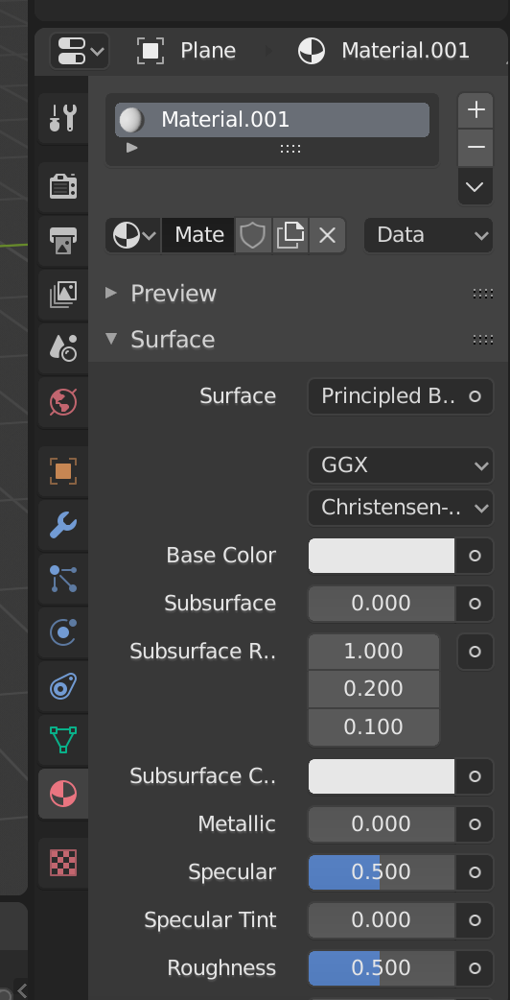

The Surface setting is where we're declaring how light should bounce around. We want to pick DiffuseBSDF, which stands for bidirectional scattering distribution function, if you're interested.

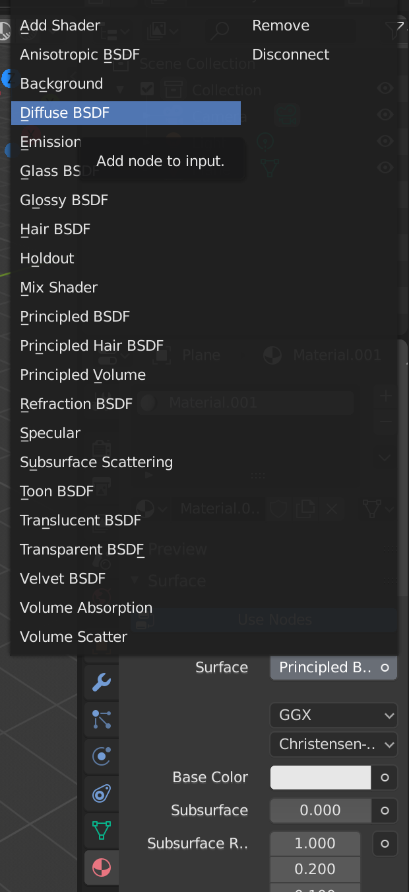

Let's take a look and see what happens when we render our scene at this point:

Yep, pretty boring.

But we did do something. If we go to that little editor type button in the upper left and switch to a Shade Editor, we can see that we added some information that controls our mesh:

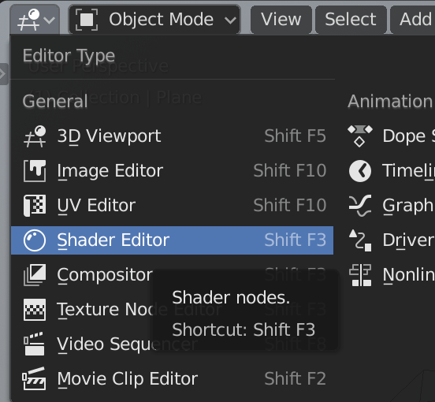

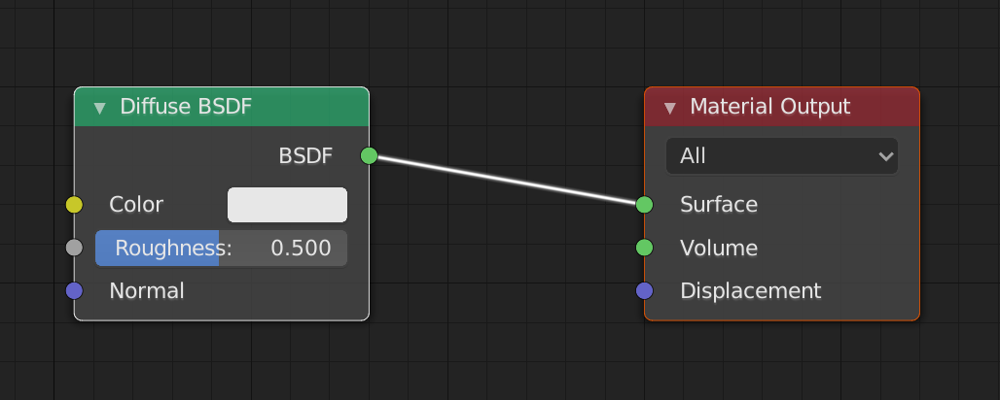

To have our plane deform into a landscape, we have to tell it we want it to get displaced from its flat space AND we have to supply the data that tells it *how* to deform.

To have our elevation information actually mold our mesh to respresent the landscape, we need to displace the mesh from the flat plane. Blender has many ways of working with making mesh surfaces "bumpy", but we want to force true displacement. So under the "Material" properties, look for the setting "Displacement" and change it from *Default* to *Displacement*:
  
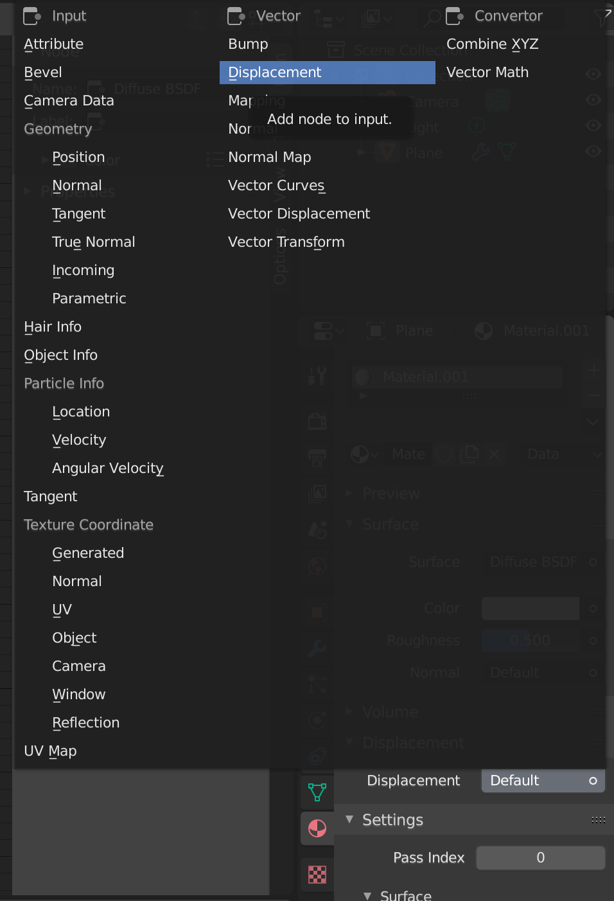  
  
Adding dimension – image texture
	Subdividing surface
	UV discussion (quick)
		render
	
## Adjusting our View

## Adjusting our Light Source

