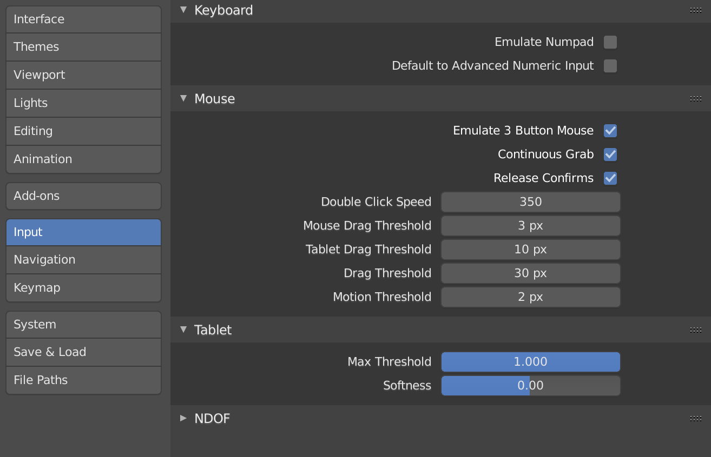

# Blender: Making topographic relief beautiful

## Tutorial Overview
Blender is a complex, opensource 3D animation software that we can use for rendering digital elevation models for beautiful relief cartography and scene building. The advantage of Blender is it’s built for flexible light simulation so we can create more realistic visuals on our landscape within this software relative to GIS platforms.

The UI for Blender is overwhelming (SO MANY THINGS!), but this tutorial is meant to direct you to the bits you need for topographic rendering.

This exercise follows an excellent and more detailed tutorial by Daniel Huffman, but I've pulled out the skeleton of his workflow and updated the visuals with the 2.8 release UI and nuances. For more in-depth discussion of what we're doing, please see his tutorial for 2.79 (He'll be updating for 2.8 soon!). It's excellent: [Huffman Tutorial](https://somethingaboutmaps.wordpress.com/2017/11/16/creating-shaded-relief-in-blender/)

**What we'll do:**

- Touch on prepping digital elevation data
- Get oriented to Blender’s UI
- Build a "mesh" that we mold with our elevation data
- Set up our “photography studio” to highlight our topography with our desired perspective
- Final product: a Blender file that will let us easily create a hillshade for any DEM we want!

## Needed Things

**Blender Software & Height Map**

You can download Blender software here: [Blender download](https://www.blender.org/)

Get 2.8! This new, and very different version has a much slicker interface and many of the odd hangups from previous releases have been happily tweakee, so we don't have to do all the steps that 2.79 required. However, if you're following instructions made before this release for whatever you're investigating, you can still get older versions.

In the next section, we'll briefly discuss how to prep a height map to use in Blender, but there are two provided for you in this tutorial to get you started in the *data* folder:

AOI_SouthArapahoePeak	(xxx x xxxxx)
HuffmanDEM.tif		(2000 x 2800 pixels)

*Remember the pixel dimensions of your file. You'll need them!*

## Make a Height Map

**Building a .tif Blender can understand from digital elevation data (DEM)**

Here are the brief steps that you need to follow to create your own DEM file

- Get data – think about your needed resolution!
	10m x 10m?  - National Elevation dataset
	30m x 30m? – JAXA …

- Mosaic/merge elevation rasters if needed (you need this if your data is coming in more than one file)

- Reproject your raster to your final CRS before you put anything in Blender!

- Clip to your AOI

- Resample DEM if you want to lower its resolution

- Rescale – Blender NEEDS to read an INTEGER TIFF and will round data to integers…
	thus losing a lot of information in the elevation data if we don’t rescale. Say your original data runs from 40.7m – 120.4m… blah blah blah. Also, if you’re working in Death Valley or wanting to use bathemytry, we need to get rid of negative values because Blender won’t understand them. Our final output target is going to be a 16-bit unsigned integer TIFF. This means that each pixel can hold a number between 0 and 65,535.
	
This equation is your friend: (PixelValue – LowElev) ÷ (HighElev – LowElev) * 65,535
 
## Blender Orientation

**What are ALL THESE THINGS?**

Okay, I'm not answering that because the GUI is overwhelming, but here's how to start...

When you first open Blender 2.8, you'll see something like this:

Click anywhere to make the cute characters go away and you'll be asked to set a default for your spacebar. Because we're not focused on animations, I recommend switching away from *Play* to *Tools*:

After all the startup windows disappear, you'll see a workspace where we have a studio for viewing and illuminating a landscape we build based off of our height map. You'll see three objects surrounded by a bunch of buttons. It looks like this:

The cube in the middle is the default object Blender loads to work with. The cube is one kind of base mesh for constructing shapes. We're going to use a different mesh for our landscape, but we'll play with this one for starters.

The weird, floating, see-through pyramid with a triangle on it is our camera. When Blender renders a scene, it is the perspective of this camera that forms the view.

The third thing, the dot with dashed haloes, is the light source for our studio.

**Navigating**

Moving around in this interface is not intuitive. And it's really hard without a 3-button mouse unless we tell Blender we're lowly geospatial folk that aren't equipped with gamer hardware. So, **IMPORTANT**: We need to set our user preferences by going up to the menus at the top and follow

Edit > Preferences > Input

and toggle on the option for "Emulate 3-Button Mouse."

## Creating our Landscape Mesh

**Add a Plane**

Let's go to our Render tab and see what this looks like...
		
**Adjust location and size**

**Assigning a Material**
	
To have our elevation information actually mold our mesh to respresent the landscape, we need to displace the mesh from the flat plane. Blender has many ways of working with making mesh surfaces "bumpy", but we want to force true displacement. So under the "Material" properties, look for the setting "Displacement" and change it from *Default* to *Displacement*:
  
  
  
Adding dimension – image texture
	Subdividing surface
	UV discussion (quick)
		render
	
## Adjusting our View

## Adjusting our Light Source

