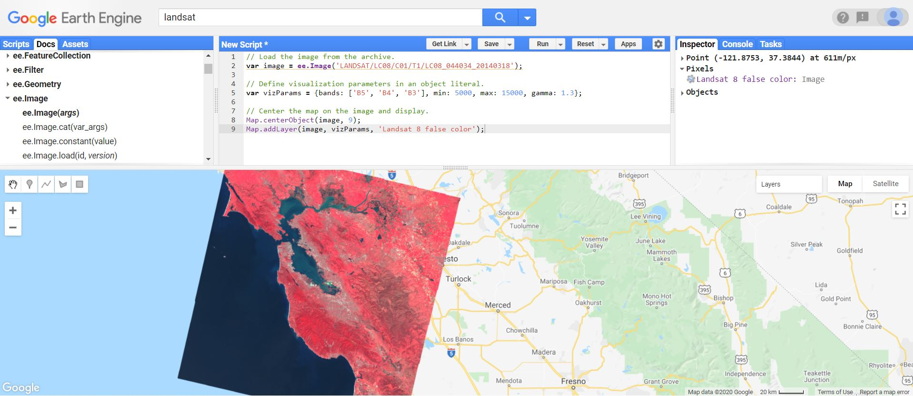
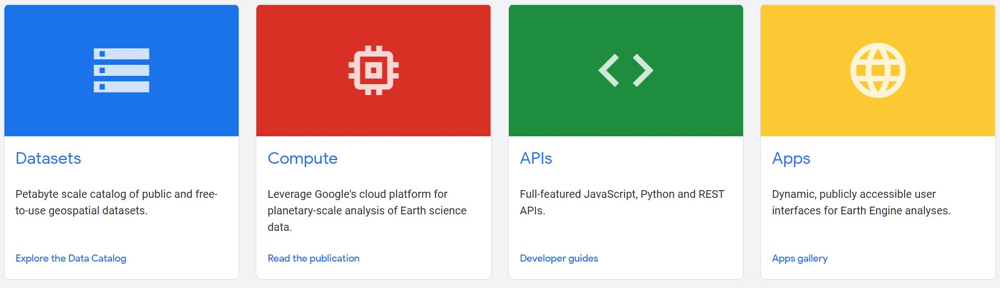
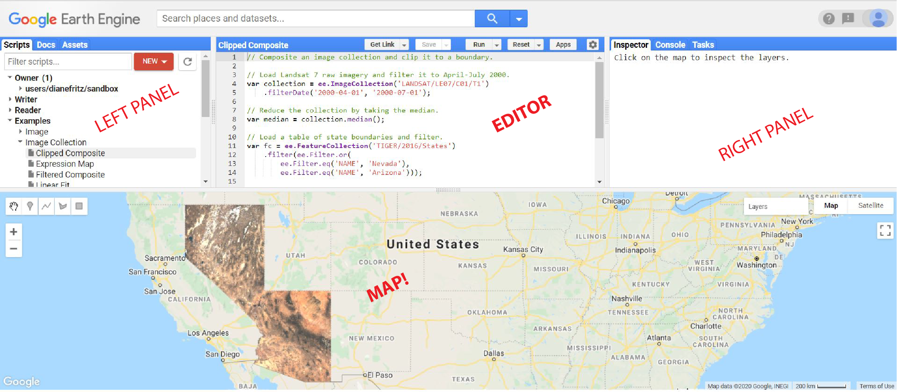
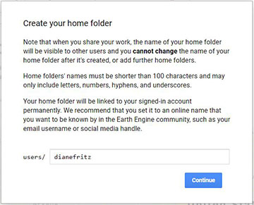
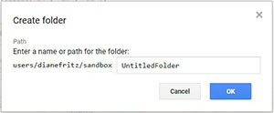
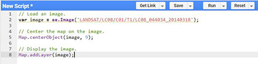
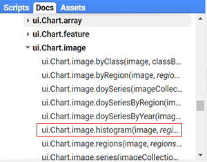
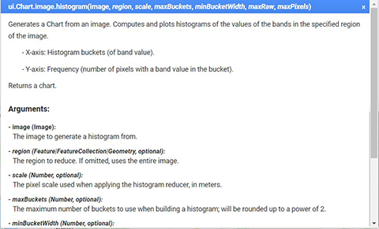

# Introduction to Google Earth Engine

## What is Google Earth Engine?

We're mostly familiar with Google Earth: Flying around 2D and 3D renderings of the globe to explore information and imagery of our planet. You can add KML data to it and create projects of discovery. Pretty good stuff.

**This is Google Earth:**


**But this is Google Earth ENGINE:**



It's a planetary-scale platform for doing data science. Google Earth Engine allows users to run algorithms on georeferenced imagery and vectors stored on Google's infrastructure. Instead of being just an observer, you have the ability to conduct spatial analysis on the global datasets found in Earth Engine's data catalog. You can also load your own data for your projects, or even submit a request a particular dataset you'd like Earth Engine to host.

What's on offer:



The [Google Earth Engine Homepage](https://developers.google.com/earth-engine) is where you can launch into this adventure and find all kinds of resources, but this tutorial can be a streamlined way to get started.

You have to apply to have one (and only one) Google account approved for access. Do read the [Terms of Service](https://earthengine.google.com/terms/) carefully.

NOTE: *This tutorial is in the context of nonprofit, research, and education use. Commercial applications of Google Earth Engine require a paid commercial license.*

A good place for more orientation: https://earthengine.google.com/faq/

And once you sign up, you'll have access to the code editor shown above where you can follow along with the excellent [Javascript Starting Guide](https://developers.google.com/earth-engine/guides/getstarted). (Python installs are an option as well, but the guide examples are mainly Javascript.) 

## The Earth Engine Data Catalog

The candy store of earth observation (EO) data is here!: https://developers.google.com/earth-engine/datasets

## Geospatial data

In case you're not familiar with data normally used in geospatial data science, there are basically two *main* classes:
- Raster:  Think of pixels in a digital photograph or ones assigned an elevation value in a digital elevation model (DEM)
- Vector:  Think about "drawn" points, lines or polygons that could represent points of interest (POIs), streams, or civic boundaries

Geospatial analysis involves geoprocessing (querying, statistical analysis, clipping, spatial joining, etc.) these data layers in defined workflows developed for a particular research question. Some of these processes will be shown in the examples at the end. What those questions might be can be spurred by the data available, so have fun exploring the catalog (or heck, exploring Google Earth and THEN Earth Engine's data catalog)!

### Data types you'll see in Earth Engine

"Images" - These are the raster layers

"Feature Collections" - These are the vector layers, where one feature might be a single state like Alaska in a feature collection of all the U.S. states.

Load your own! - These are stored in your "Assets" and remain private
- GeoTIFF
- TFRecord
- Shapefiles
- CSVs (lat/lon columns, or spatial geometry column such as geoJSON)

### Remote Sensing = the bread and butter of image data in Earth Engine

Knowledge about the missions that supply the bulk of the data to this platform will help you grasp the kind of analysis that is possible. Aspects to think about for each one:
- Launch date
- Decommision date (if applicable)
- Temporal coverage
- Spatial coverage
- Bands

Here are some resources for some of the main ones:

| [Landsat](https://www.usgs.gov/core-science-systems/nli/landsat/landsat-satellite-missions) | [MODIS](https://modis.gsfc.nasa.gov/about/) | [Sentinal](https://sentinel.esa.int/web/sentinel/home) | [SRTM](https://www2.jpl.nasa.gov/srtm/index.html) |


## The Code Editor

Use your registered Google account to access the code editor here:
https://code.earthengine.google.com/



| Left panel | Center panel | Right panel | Bottom panel |
| ------------ | ---------- | ----------- | ------------ |
|Code Examples |(Javascript) Code editor | Inspector for querying the map (gives info about the layers) | Map Output! (Base Map + layers added from script)|
|Your saved scripts | | Output console | |
|Searchable API reference | | Manager for long-running tasks | |
|Asset manager for private data | | |


## Getting Started

*Request access to Google Earth Engine*
- There's a handy button for that here: https://developers.google.com/earth-engine/

*Wait for your approval email*
- This will come to your one account registered with Google
- It comes pre-loaded with helpful links!

*Open the Code Editor and log in with your registered email*
- https://code.earthengine.google.com/

*Create a home folder, repositories and folders under "Scripts" tab > Owner*
- You won't be able to change the name of your home folder, so choose wisely!


- Repositories can be project specific, topic specific ... just have a consistent system.
- Recommendation: create a "sandbox" or "scratch" repository!
- Create individual folders and files in each repository as needed.



*Load code examples or write your own and start playing!*


- Look under "Examples" under the Scripts tab and click on them to auto-load scripts
- The Docs tab has a great guide for API calls. Here's an example for a histogram function and needed/optional arguments:
 Click ----> 

## Examples

### Printing to the Console

You can print output directly in the console panel. Try pasting this in, hitting Run, then checking the console tab:

```
print('Hello world!');
```
Or you can print metadata from an image collection and see it!:

```
print(ee.Image('LANDSAT/LC08/C01/T1/LC08_044034_20140318'));
```


### Loading a Satellite Image

```
// Load the image from the archive.
var image = ee.Image('LANDSAT/LC08/C01/T1/LC08_044034_20140318');

// Define visualization parameters in an object literal.
var vizParams = {bands: ['B5', 'B4', 'B3'], min: 5000, max: 15000, gamma: 1.3};

// Center the map on the image and display.
Map.centerObject(image, 9);
Map.addLayer(image, vizParams, 'Landsat 8 false color');

```

### Colorado Elevation

```
// Plot a histogram of elevation in Colorado.

var elevation = ee.Image('CGIAR/SRTM90_V4');
var colorado = ee.Geometry.Rectangle({
  coords: [-109.05, 37, -102.05, 41],
  geodesic: false
});

// Generate the histogram data.  Use minBucketWidth for nice sized buckets.
var histogram = ui.Chart.image.histogram({
  image: elevation,
  region: colorado,
  scale: 200,
  minBucketWidth: 300
});
histogram.setOptions({
  title: 'Histogram of Elevation in Colorado (meters)'
});

print(histogram);

Map.addLayer(elevation.clip(colorado));
Map.setCenter(-107, 39, 6);

```

### Urban Areas Impervious Surface Growth

```
// Draft script for examining impervious transitions by census tract
// by Diane Fritz
// 20201027

//Load temporal impervious surface and census tract data
var imperv = ee.Image("Tsinghua/FROM-GLC/GAIA/v10");
var tracts = ee.FeatureCollection('TIGER/2010/Tracts_DP1');

// Use Inspector on TIGER Tracts layer on map to find census tract of interest
// Look under "properties" and enter unique tract geoid below

// var tractgeoid = '08031001902'; //Auraria CO
// var tractgeoid = '08031980000'; //DIA CO
// var tractgeoid = '49035113107'; //Herriman UT
var tractgeoid = '08031001902';

// Create single census tract feature
var singletract = ee.FeatureCollection('TIGER/2010/Tracts_DP1')
    .filter(ee.Filter.eq('geoid10',tractgeoid));

// Clip to the output image to selected tract
var impervselect = imperv.clipToCollection(singletract);


var impervvis = {
  bands: ['change_year_index'],
  min: 0.0,
  max: 34.0,
  opacity: 0.7,
  palette: [
    "014352","1A492C","071EC4","B5CA36","729EAC","8EA5DE",
    "818991","62A3C3","CCF4FE","74F0B9","32BC55","C72144",
    "56613B","C14683","C31C25","5F6253","11BF85","A61B26",
    "99FBC5","188AAA","C2D7F1","B7D9D8","856F96","109C6B",
    "2DE3F4","9A777D","151796","C033D8","510037","640C21",
    "31A191","223AB0","B692AC","2DE3F4",
  ]
};

// Reset lon & lat and zoom level to tract of interest.
// Map.setCenter(-105.01, 39.747, 14.5); //Auraria
// Map.setCenter(-104.70, 39.855, 12.5); //DIA
// Map.setCenter(-112.01, 40.515, 13); //Herriman

// Choose layers you want to visualize on the map by uncommenting line:

// Map.addLayer(imperv, impervvis, "Change year index");
// Map.addLayer(impervselect, impervvis, "Change year index");
// Map.addLayer(tracts);
// Map.addLayer(singletract);


// Generate the histogram data for selected tract
var histogram = ui.Chart.image.histogram({
  image: impervselect,
  region: singletract,
  scale: 15,
  minBucketWidth: 1
});
histogram.setOptions({
  title: 'Histogram of Transition to Impervious Surface (Year Codes)'
});

print(histogram);

```
