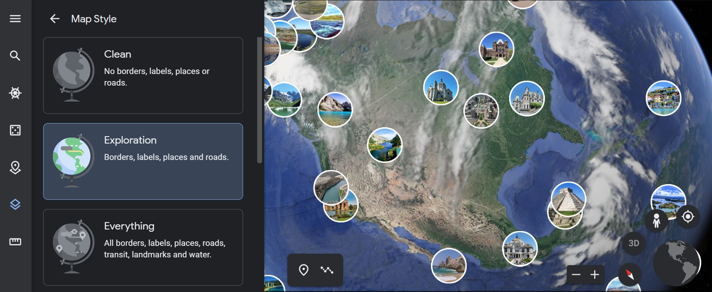

# Introduction to Google Earth Engine

## What is Google Earth Engine?

We're all fairly familiar with Google Earth: Flying around 2D and 3D renderings of the globe to explore information and imagery of our planet. You can add KML data to it and create projects of discovery. Pretty good stuff.

This is Google Earth:

But this is Google Earth ENGINE:

It's planetary-scale platform for doing data science. Google Earth Engine allows users to run algorithms on georeferenced imagery and vectors stored on Google's infrastructure. Instead of being an observer, you have the ability to conduct spatial analysis on the global datasets found in Earth Engine's data catalog (as well as on your own datasets!).

What's on offer:

You have to apply to have one (and only one) Google account approved for access. Do read the [Terms of Service](https://earthengine.google.com/terms/) carefully.

NOTE: *This tutorial is in the context of nonprofit, research, and education use. Commercial applications of Google Earth Engine require a paid commercial license.*

A good place for more orientation: https://earthengine.google.com/faq/

And once you sign up, you'll have access to the code editor shown above where you can follow along with the excellent [Javascript Starting Guide](https://developers.google.com/earth-engine/guides/getstarted). (Python installs are an option as well, but the guide examples are mainly Javascript.) 

## The Earth Engine Data Catalog

https://developers.google.com/earth-engine/datasets

## Data

### Types

Image

Vector

Load your own!
- Shapefiles
- CSVs (lat/lon columns, or spatial geometry column such as geoJSON)

### Satellites

## The Code Editor

Use your registered Google account to access the code editor here:
https://code.earthengine.google.com/

*CENTER panel*
- Javascript code editor

*LEFT panel*
- Code examples
- Your saved scripts
- Searchable API reference
- Asset manager for private data

*RIGHT panel* 
- Inspector for querying the map (gives info about the layers)
- Output console
- Manager for long-running tasks

*BOTTOM panel*
- Map Output! (Base map plus layers added from script)

## Getting Started

## Javascript

## Examples

### Loading a Satellite Image

### Colorado Elevation

### Urban Albedo
