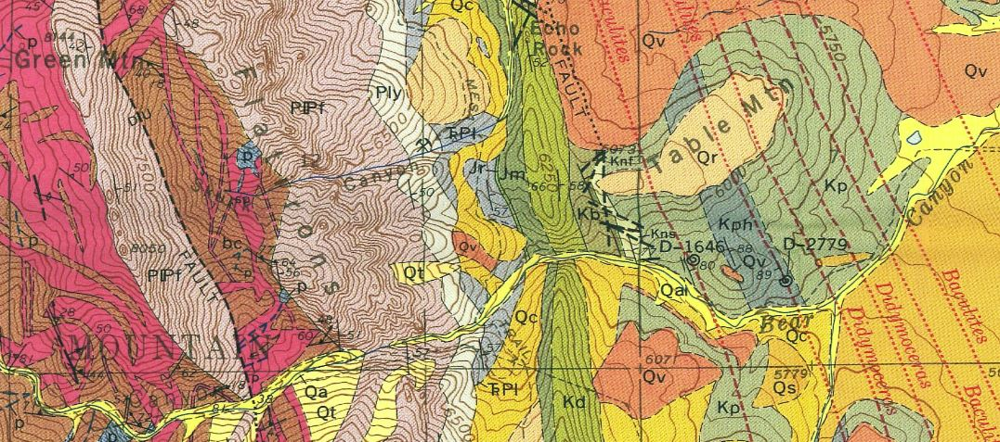
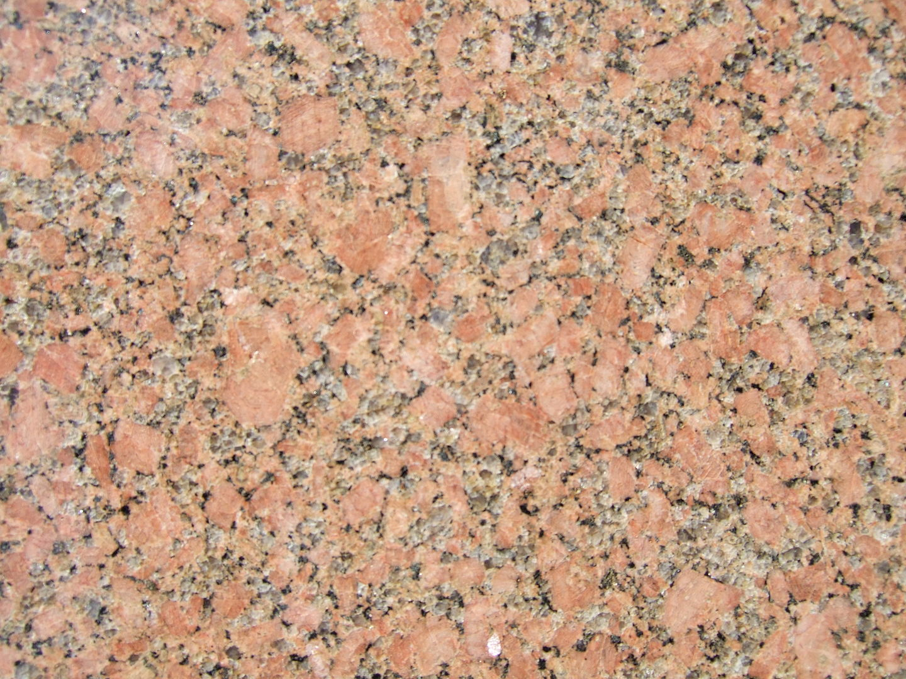
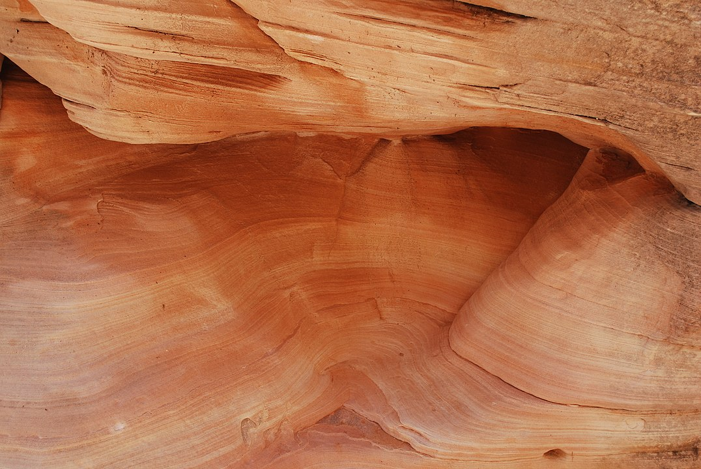
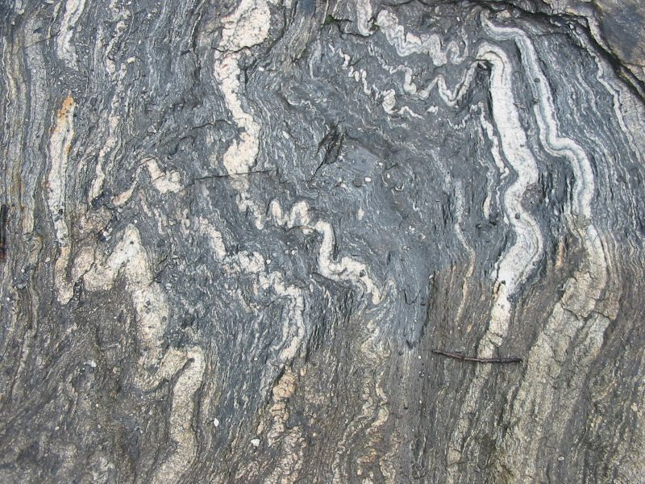

# Geologic Maps: Intro to rocks and QGIS

*Detail of Eldorado Springs Geologic Quadrangle, Wells, 1961*

## What this tutorial will cover:

Introduction to the rock cycle and main rock types:
- sedimentary
- igneous
- metamorphic

Quick look at the Geologic Time Scale

Orientation to some geologic terms and structures
- strike
- dip
- fault (normal, thrust or reverse, strike/slip)

How to find the above geologic things on a map

Quick look into how you can create and edit geologic maps in QGIS

## What this tutorial won't do:

This tutorial won't make you a structural geologist qualified to make geologic maps from scratch. Real geologic maps are based on mind-boggling amounts of scientific training and field work. For more information see this [USGS description](https://www.usgs.gov/core-science-systems/national-cooperative-geologic-mapping-program/science/introduction-geologic?qt-science_center_objects=0#qt-science_center_objects)

# GEOLOGY!
# Part I: Rocks

*The Rock Cycle*

The surface of the earth is a dynamic system and this applies to rocks as well! The time scale is on a longer extent than what we can see in the motion of water, for example. It's harder for our brains to grasp, but rocks do move.

The simplistic summary of the rock cycle is: 
- Molten material cools into solid rocks as it comes to or near to the earth's surface creating igneous rocks.
- Erosion wears existing rocks into sediment or dissolved chemicals that generally get carried from higher elevations and deposited into flat layers at lower elevations.
- These layers get buried and compressed and turned into sedimentary rocks. If they get exposed to an environment with enough heat and pressure to start changing the mineral sturcture, they become metamorphic rocks or melt completely again.

*By I, Friman, CC BY-SA 3.0, https://commons.wikimedia.org/w/index.php?curid=2421115*

*By Hasmodius, CC BY-SA 4.0 https://commons.wikimedia.org/wiki/File:Valley_of_Fire_Sandstone_layers_exposed_by_erosion.jpg*

*https://commons.wikimedia.org/wiki/File:Migma_ss_2006.jpg*

# Part II: Structures

# Part III: QGIS mapping

pull in GeoTIFF
Babble about tracing/editing, but don't actively do it... load file with one or two polygons for lithologies
changing symbols

For those of you new to QGIS, there is a strong developer community surrounding this open source software and great plugins are continually being created and improved.  If you don't already have QGIS on your computer, you can download it at [qgis.org](https://www.qgis.org/en/site/)

We'll be using two plugins:  (keep this? - check out geology plugins)
- QuickMapServices

To add them to your QGIS, go to the "Plugins" tab on the main menu and select "Manage and Install Plugins..."

A window will open that has many plugin options listed alphabetically. Go to the Q's and install the two mentioned above. Your window should look something like this when they've been added:

The QuickMapServices plugin is a way of quickly adding in basemaps to your project. XYZ tiles is richer way to add basemaps, but we'll stick with adding in the standard OSM basemap for now: from the main menu bar go to Web -> QuickMapServices -> OSM -> OSM Standard.

## Import a georeferenced geologic map

Let's say we have this old geologic map, but we want to create a digital version of it so easily add our adjustments with more accurate field data.

## Create a simple map in QGIS

We've already added a basemap to our project, but let's make our map a little more interesting before we use qgis2web to export our map to the web. One great thing about interactive web maps is the possiblity of pop-ups that show the attribute information behind the features on our map.

Add the data layer *parkingmeters.geojson* to your QGIS map. You should be able to merely drag it from your folder and drop it into the blank area below the OSM Standard basemap layer. You'll then have a working space that looks something like this:

**Examine your data!**

Once the parkingmeters layer appears in your QGIS contents, right click on the layer and select "Open Attribute Table". Here, you can examine the fields and try to figure out all the information that has been recorded about these spatial features. Of course, if the information is opaque, there should be metadata on the Denver Open data site that explains it better!

**Symbolize your data**

*Simple Symbol*

Right click on the layer again, but this time select "Properties". This will open up a new window with a number of menu options. Pick "Symbology". Keep the default Simple Symbol option for exploring pop-ups, but play with the color and marker options.

*SVG Symbol*

In order to use one of the Geologic symbols from our library, we need to switch our symbology to an SVG symbol and pick one from our library.

**Have fun with these different methods of creating web maps!**
