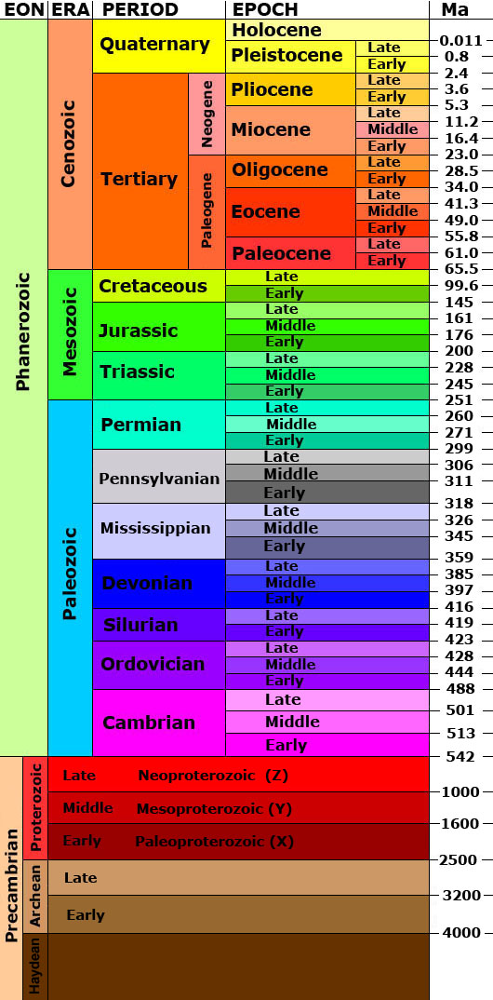
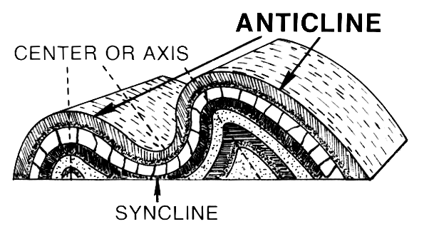
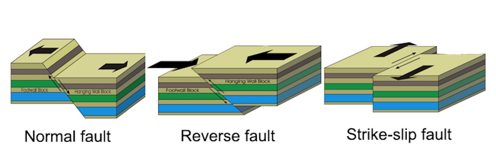

# Geologic Maps: Intro to rocks and QGIS

*Detail of Eldorado Springs Geologic Quadrangle, Wells, 1961*

## What this tutorial will cover:

Introduction to the rock cycle and main rock types:
- igneous
- sedimentary
- metamorphic

Quick look at the Geologic Time Scale

Orientation to some geologic terms and structures
- strike
- dip
- fault (normal, thrust or reverse, strike/slip)

How to find the above geologic things on a map

Quick look into how you can create and edit geologic maps in QGIS

## What this tutorial won't do:

This tutorial won't make you a structural geologist qualified to make geologic maps from scratch. Real geologic maps are based on mind-boggling amounts of scientific training and field work. For more information see this [USGS description](https://www.usgs.gov/core-science-systems/national-cooperative-geologic-mapping-program/science/introduction-geologic?qt-science_center_objects=0#qt-science_center_objects)

# GEOLOGY!
## Part I: Rocks & Time

*The Rock Cycle*

The surface of the earth is a dynamic system and this applies to rocks as well! The time scale is on a longer extent than what we can see in the motion of water, for example. It's harder for our brains to grasp, but rocks do move.

The simplistic summary of the rock cycle is: 
- Molten material from levels below the earth's crust cools into solid rocks as it comes to or near to the earth's surface creating igneous rocks.
- Erosion wears existing rocks into sediment or dissolved chemicals that generally get carried from higher elevations and deposited into flat layers at lower elevations.
- These layers get buried and compressed and turned into sedimentary rocks. If they get exposed to an environment with enough heat and pressure to start changing the mineral sturcture, they become metamorphic rocks or melt completely again.

GRANITE (an igneous rock type):

*By I, Friman, CC BY-SA 3.0, https://commons.wikimedia.org/w/index.php?curid=2421115*

SANDSTONE (a sedimentary rock type):

*By Hasmodius, CC BY-SA 4.0 https://commons.wikimedia.org/wiki/File:Valley_of_Fire_Sandstone_layers_exposed_by_erosion.jpg*

MIGMATITE (a metamporhic rock type):

*https://commons.wikimedia.org/wiki/File:Migma_ss_2006.jpg*

### Geologic Time

The rock cycle happens over times that we have a hard time imagining. For reference, see the figure below that diagrams out geologic time. Note: Ma stands for "millions of years ago."

## Part II: Structures

When sedimetary layers are deposited, they are put down in flat layers. After the layers are changed into rock, all sorts of forces can then act on them to deform the orientation of these sedimentary rocks. Some of the more simplistic terms and structures are:

- Dip = When a sedimentary bed is tilted, dip describes how many degrees it has shifted from horizontal in a particular location

- Strike = When the bed tilts, it does so around an axis. The direction that axis points is the strike of that bed.

*Diagram by GeologyWolf

- Synclines = a downward fold in sedimentary beds

- Anticlines = an upward fold in sedimentary beds

*Diagram by Pearson Scott Foresman*

Imagine slicing off the top of these folds (eroding them away) and what that may look like exposed on the earth's surface.

- Faults = fractures through rocks showing a significant discontinuity in the volume of rock

*Diagram from www.GeologyPage.com*

Plate tectonic forces also work on igneous and metamporhic rocks, but their effects are most obvious on sedimentary rocks.

### Representing structures on a map

The black lines and symbols you see scattered on geologic maps are a short-hand for describing the structures mentioned above. See this [guide](https://commons.wvc.edu/rdawes/G101OCL/Basics/BscsTables/geomapsymb.html#sdtable) for examples.

There is also an amazing source of many of the point symbols used in geologic maps made available by ________ and included in the data folder in this tutorial.

The blobs of color with differnt etch patterns show the surface exposures of different kinds of rocks, often with their ages wrt the Geologic Time Scale. Refer to the individual legends of each geologic map for more information.

## Part III: QGIS mapping

(pull in GeoTIFF
Babble about tracing/editing, but don't actively do it... provide file with one or two polygons for lithologies
draw one field data point
change symbols: add lithology swatch, change to svg strike/dip symbol)

For those of you new to QGIS, there is a strong developer community surrounding this open source software and great plugins are continually being created and improved.  If you don't already have QGIS on your computer, you can download it at [qgis.org](https://www.qgis.org/en/site/)

### Import a georeferenced geologic map

Let's say we have this old geologic map, but we want to create a digital version of it so easily add our adjustments with more accurate field data.

*Trace lithologies and symbolize*

## Add a symbol to our map to indicate new field data

*Add point*

*SVG Symbol*

Right click on the layer and select "Properties". This will open up a new window with a number of menu options. Pick "Symbology".

In order to use one of the Geologic symbols from our library, we need to switch our symbology from the default simple symbol to an SVG symbol and pick one from our library.

**Have fun with these different methods of creating web maps!**
