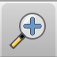
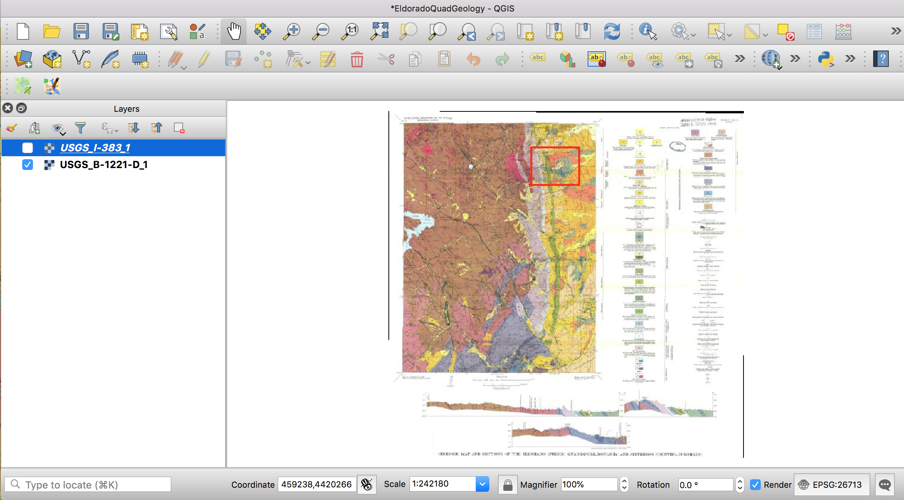

# Geologic Maps: Intro to rocks and QGIS

*Detail of Eldorado Springs Geologic Quadrangle, Wells, 1961*

## What this tutorial will cover:

Introduction to the rock cycle and main rock types:
- igneous
- sedimentary
- metamorphic

Quick look at the Geologic Time Scale

Orientation to some geologic terms and structures
- strike and dip
- antclines, synclines and monoclines
- faults (normal, thrust or reverse, strike/slip)

How to find the above geologic things on a map

An intro into how you can create and edit geologic maps in QGIS

## What this tutorial won't do:

This tutorial won't make you a structural geologist qualified to make geologic maps from scratch. Real geologic maps are based on mind-boggling amounts of scientific training and field work. For more information see this [USGS description](https://www.usgs.gov/core-science-systems/national-cooperative-geologic-mapping-program/science/introduction-geologic?qt-science_center_objects=0#qt-science_center_objects)

# GEOLOGY!
## Part I: Rocks & Time

*The Rock Cycle*

The surface of the earth is a dynamic system and this applies to rocks as well! The time scale is on a longer extent than what we can see in the motion of water, for example. It's harder for our brains to grasp, but rocks do move.

The simplistic summary of the rock cycle is: 
- Molten material from levels below the earth's crust cools into solid rocks as it comes to or near to the earth's surface creating igneous rocks.
- Erosion wears existing rocks into sediment or dissolved chemicals that generally get carried from higher elevations and deposited into flat layers at lower elevations.
- These layers get buried and compressed and turned into sedimentary rocks. If they get exposed to an environment with enough heat and pressure to start changing the mineral sturcture, they become metamorphic rocks or melt completely again.

There are many different subsets of rock types under the three main just mentioned (igneous, sedimentary and metamporphic). The difference between them depends on chemical compositions and mineral sizes, both factors being dependent on the environment in which the rock was formed. See this [page](https://geology.utah.gov/map-pub/survey-notes/glad-you-asked/igneous-sedimentary-metamorphic-rocks/) for more details.

Here are some classic examples of the three main rock types:

GRANITE (an igneous rock type):

*By I, Friman, CC BY-SA 3.0, https://commons.wikimedia.org/w/index.php?curid=2421115*

SANDSTONE (a sedimentary rock type):

*By Hasmodius, CC BY-SA 4.0 https://commons.wikimedia.org/wiki/File:Valley_of_Fire_Sandstone_layers_exposed_by_erosion.jpg*

MIGMATITE (a metamporhic rock type):

*https://commons.wikimedia.org/wiki/File:Migma_ss_2006.jpg*

### Geologic Time

The rock cycle happens over times that we have a hard time imagining. For reference, see the figure below that diagrams out geologic time. Note: Ma stands for "millions of years ago."

## Part II: Structures

When sedimetary layers are deposited, they are put down in flat layers. After the layers are changed into rock, all sorts of forces can then act on them to deform the orientation of these sedimentary rocks. Some of the more simplistic terms and structures are:

- Dip = When a sedimentary bed is tilted, dip describes how many degrees it has shifted from horizontal in a particular location

- Strike = When the bed tilts, it does so around an axis. The direction that axis points is the strike of that bed.

*Diagram by GeologyWolf*

- Synclines = a downward fold in sedimentary beds

- Anticlines = an upward fold in sedimentary beds

*Diagram by Pearson Scott Foresman*

Imagine slicing off the top of these folds (eroding them away) and what that may look like exposed on the earth's surface.

- Faults = fractures through rocks showing a significant discontinuity in the volume of rock

*Diagram from www.GeologyPage.com*

Plate tectonic forces also work on igneous and metamporhic rocks, but their effects are most obvious on sedimentary rocks.

### Representing structures on a map

The black lines and symbols you see scattered on geologic maps are a short-hand for describing the structures mentioned above. See this [guide](https://commons.wvc.edu/rdawes/G101OCL/Basics/BscsTables/geomapsymb.html#sdtable) for examples.

There is also an amazing source of .svg files of the point symbols used in geologic maps created by Dr. Richard Langford, a geologic consultant living in Tasmania.  Some of these symbols are included in the data folder in this tutorial.

The blobs of color with differnt etch patterns show the surface exposures of different kinds of rocks, often with their ages wrt the Geologic Time Scale. Refer to the individual legends of each geologic map for more information.

## Part III: QGIS mapping

For those of you new to QGIS, there is a strong developer community surrounding this open source software. If you don't already have QGIS on your computer, you can download it at [qgis.org](https://www.qgis.org/en/site/). New great plugins are continually being created and improved and those can be added as well from the "Plugins" tab, but we aren't using any in this tutorial.

### Import a georeferenced geologic map

Let's say we have this old geologic map, but we want to create a digital version of it so we can easily add our adjustments with more accurate field data. Luckily for you, we have a map that is already geo-referenced based on the original projection of the map (NAD27 UTM Z13 ... and yes, this map was made in 1967!). In the data folder, you'll see the preliminary map (USGS_I-383) as well as the final product (USGS_B-1221-D).

To add a GeoTIFF, go to the add data button , select raster and, using the three-dot button, navigate to the file you want... the one ending with .tif only!

The projection of your project will be automatically selected based on this georeference map. Your workspace should look approximately like this:

### Add new field data

On this map, we can see a number of places where we see strike/dip symbols with numbers by them. Remember, these are showing how steeply the beds tilt, and in which direction they are tilting. We're going to pretend we went out into the field and collected some more information like this with our Brunton compass. Of course, we would have the location data from our field notebook and would import the spreadshee of data, but for this tutorial we're going to fake it and draw approximate locations.

Zoom into the map using the zoom button  to the approximate area shown in the red rectangle:

*Create Layer*

To draw in our new field data, we need to create a layer we can edit. Go to the "Layers" menu at the very top, and select "Create Layer" from the drop-down. There are different kinds of geospatial data formats you can pick, but we'll use a shapefile for now.

*Add point*

Now that we have a layer to which we can write, we need to toggle on its editing capability. Select the layer so it's highlighted in blue, then click the Toggle Editing button:  Now a number of other functions are no longer greyed out and we can add a point.

Click the Add Point button  and then, when your cursor looks like a target, click on the Kd Formation somewhere near the middle so you get something that looks like this:

But that's just a dot and we want to add some information about our strike and dip data with a geologic symbol. This is where Dr. Langford's work in Inkscape to create .svg files for us from the USGS style book comes in handy. We'll be using the file 6.02_bdg_incld
.svg

*SVG Symbol*

Right click on the layer and select "Properties". This will open up a new window with a number of menu options. Pick "Symbology".

In order to use one of the Geologic symbols from our library, we need to switch our symbology from the default simple symbol to an SVG symbol and pick one from our library.

### Trace lithologies and symbolize

For your convenience, I've traced one bit of the Rocky Flats Alluvium and one bit of the Dakota Group for you. You can find them in the file EldoradoQuadLithologies.zip.

**Enjoy your new geologic knowledge and how to show it off on a map!**
