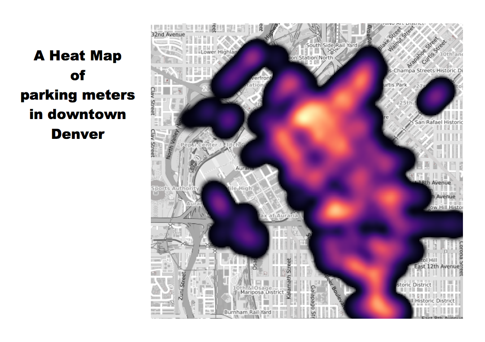

# Web Mapping: Playing with Leaflet and qgis2web

## What is a web map anyway?

**Digitized Maps vs Web Maps**

  

Web maps, or slippy maps, are based on tiles that load on demand so you limit the data you use to the data you need to see. For more orientation to how they are structured (zoom levels and distibutions) visit this [wikipage](https://wiki.openstreetmap.org/wiki/Slippy_map_tilenames)

## What do we need to make them? PART I: Leaflet

- A Web Browser
- A Text Editor
- Directories, Files, Data and Media
- Web Server
- Web Developer Tools

## Set up

The first thing we need to do to create a web map using Leaflet is to set up a development environment. This allows you to write code and test how your map looks and works.

**A Web Browser**

While were making a map to be seen in a browser, we use a brower. Pretty simple. But not all browsers are created equally. Use Chrome or Firefox when you're doing web development.

**A Text Editor**

To use Leaflet to build our webmap, we'll be working directly in text. You'll want a text editor that helps you see code easily by highlighting the different functions of the syntax. These three are are commonly used:

* [Brackets](http://brackets.io/)
* [Sublime](https://www.sublimetext.com/)
* [Atom](https://atom.io/)

If you don't want to bother with setting up a local server, use Brackets! Its "Live Preview" functionality runs a local test server for you within your web browser. You'll see a new browser window pop up where you can see and test your application.


**A Web Server**

A "server" is needed to gather the files and deliver them to the browser correctly so the brower can properly interpret and render the information. For example, a server is necessary when using JavaScript to make what are known as [asynchronous requests](http://rowanmanning.com/posts/javascript-for-beginners-async/) to load files and data into our web application after the web page initially loads.

When we put together a web map, we test it on our own computer before serving it to the web, thus the need for a "local server." Here is a nice [gist](https://gist.github.com/jgravois/5e73b56fa7756fd00b89) for setting up a local server on your machine.

OR, as mentioned, the [Brackets](http://brackets.io) text editor allows you to bypass this because it runs "Live Preview".

Now that you have a local server running, open the *blahblahblah/index.html* file (or open this file from within Brackets using the Live Preview).

## Okay, let's make a map! But wait. What IS Leaflet?

Leaflet is an open-source JavaScript library for mobile-friendly interactive maps.

Let's take a look at how it works with a simple simple webmap:

```html
<!DOCTYPE html>
<html>
<head>
  <title>A Leaflet map!</title>
  <link rel="stylesheet" href="https://unpkg.com/leaflet@1.4.0/dist/leaflet.css"
    integrity="sha512-puBpdR0798OZvTTbP4A8Ix/l+A4dHDD0DGqYW6RQ+9jxkRFclaxxQb/SJAWZfWAkuyeQUytO7+7N4QKrDh+drA=="
    crossorigin=""/>
  <script src="https://unpkg.com/leaflet@1.4.0/dist/leaflet.js"
    integrity="sha512-QVftwZFqvtRNi0ZyCtsznlKSWOStnDORoefr1enyq5mVL4tmKB3S/EnC3rRJcxCPavG10IcrVGSmPh6Qw5lwrg=="
    crossorigin=""></script>
  <style>
    #map{ width: 900px; height: 500px; }
  </style>
</head>
<body>

  <div id="map"></div>

  <script>

  // initialize the map
  var map = L.map('map').setView([39.75, -105.01], 14);

  // load a tile layer (see http://leaflet-extras.github.io/leaflet-providers/preview/ and copy w/o ""})."" or pick one below)

  // Here's a direct URL Stamen option - replace "toner" here with "terrain" or "watercolor" (watercolor has different attribution, though)
  L.tileLayer('http://tile.stamen.com/terrain/{z}/{x}/{y}.png',
    {
      attribution: 'Map tiles by <a href="http://stamen.com">Stamen Design</a>, under <a href="http://creativecommons.org/licenses/by/3.0">CC BY 3.0</a>. Data by <a href="http://openstreetmap.org">OpenStreetMap</a>, under <a href="http://www.openstreetmap.org/copyright">ODbL</a>',
      maxZoom: 17,
      minZoom: 9
    }).addTo(map);

  </script>
</body>
</html>
```
Within this code we have 3 elements that help create our map:
- [HTML](https://www.w3schools.com/html/default.asp) (structure) - the content of our webpage
- [CSS](https://www.w3schools.com/css/default.asp) (form) - the design of the webpage
- [Javascript](https://www.w3schools.com/js/default.asp) (behavior) - adding the bits that make this a non-static map!

The code in the index.html file in this repo is the same as the above with a few options alternative options added in (but commented out) for different base maps. Where might you find these? There are a bunch collected for you on this lovely [webpage](http://leaflet-extras.github.io/leaflet-providers/preview/) where you can click on the thumbnails to get blocks of code to copy and paste.

We can add in another JavaScript library called jquery to help us load geojson data onto our map:

```
<!DOCTYPE html>
<html>
<head>
  <title>A Leaflet map!</title>
  <link rel="stylesheet" href="https://unpkg.com/leaflet@1.4.0/dist/leaflet.css"
    integrity="sha512-puBpdR0798OZvTTbP4A8Ix/l+A4dHDD0DGqYW6RQ+9jxkRFclaxxQb/SJAWZfWAkuyeQUytO7+7N4QKrDh+drA=="
    crossorigin=""/>
  <script src="https://unpkg.com/leaflet@1.4.0/dist/leaflet.js"
    integrity="sha512-QVftwZFqvtRNi0ZyCtsznlKSWOStnDORoefr1enyq5mVL4tmKB3S/EnC3rRJcxCPavG10IcrVGSmPh6Qw5lwrg=="
    crossorigin=""></script>
  <script
    src="https://code.jquery.com/jquery-3.3.1.js"
    integrity="sha256-2Kok7MbOyxpgUVvAk/HJ2jigOSYS2auK4Pfzbm7uH60="
    crossorigin="anonymous"></script>
  <style>
    #map{ width: 900px; height: 500px; }
  </style>
</head>
<body>

  <div id="map"></div>

  <script>

  // initialize the map
  var map = L.map('map').setView([39.75, -105.01], 12);

  // load a tile layer (see http://leaflet-extras.github.io/leaflet-providers/preview/ and copy w/o ""})."" or pick one below)

  // Here's a direct URL Stamen option - replace "toner" here with "terrain" or "watercolor" (watercolor has different attribution, though)
  L.tileLayer('http://tile.stamen.com/terrain/{z}/{x}/{y}.png',
    {
      attribution: 'Map tiles by <a href="http://stamen.com">Stamen Design</a>, under <a href="http://creativecommons.org/licenses/by/3.0">CC BY 3.0</a>. Data by <a href="http://openstreetmap.org">OpenStreetMap</a>, under <a href="http://www.openstreetmap.org/copyright">ODbL</a>',
      maxZoom: 17,
      minZoom: 9
    }).addTo(map);

// load GeoJSON from an external file
$.getJSON("./data/firestations.geojson",function(data){
//  add GeoJSON layer to the map once the file is loaded
L.geoJson(data).addTo(map);
});

</script>
</body>
</html>
```
What is different?

1) We added in another src command to find another JavaScript library
2) Using the jquery library functions, we added a layer onto our background tiles after retrieving our data.

Notice, we changed the zoom level for the map initialization! This gave us a broader view to see more of the fire stations on load.

Note: The data we're using was pulled from the city of Denver's open data [portal](https://www.denvergov.org/opendata/) as shapefiles and then converted to geojson files using QGIS.

## What do we need to make them? PART II: qgis2web plugin for QGIS

For the popups, we may not want all of the attributes with their default values to show when we hover over our features. We can change the field labels by writing in Aliases in the QGIS Attributes Form, or we can eliminate them by switching the “Widget Type” to “Hidden.” 


In the example above, the alias for ZONE is written as “Zone” to get rid of the all-caps. If we wanted this field to not show in the pop-up at all, we would use the drop-down to change “Text Edit” to “Hidden.”
